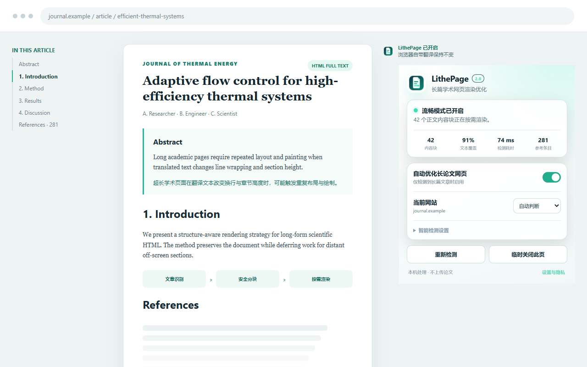

# LithePage 2.0

语言 / Language: [中文](#中文) · [English](#english)



> 该图片使用合成学术内容展示扩展界面，不包含真实用户数据或受限论文正文。
> This image demonstrates the extension with synthetic academic content. It contains no real user data or restricted article text.

<a id="中文"></a>
## 中文

LithePage 是面向超长学术 HTML 页面的本地渲染优化扩展，设计用于 Google Chrome 与 Microsoft Edge。它智能延后屏幕外正文的布局和绘制；翻译仍由浏览器自带网页翻译完成。

### 快速开始

#### 1. 下载并解压

1. 打开 [LithePage 最新版本](https://github.com/staywithGOD/LithePage/releases/latest)。
2. 下载名称中含 `Chromium.zip` 的扩展包（当前版本为 `LithePage-v2.0.0-Chromium.zip`），然后将其完整解压到一个固定文件夹；不要直接从 ZIP 压缩包中加载。
3. 打开解压后的文件夹，确认第一层可以看到 `manifest.json`。浏览器安装时应选择这一层文件夹，而不是 ZIP 文件或它的上一级目录。

在 Chrome Web Store 和 Microsoft Edge Add-ons 正式上架前，LithePage 采用下面的开发者模式安装方式。

#### 2. 安装到 Chrome

1. 在地址栏打开 `chrome://extensions`。
2. 开启右上角的“开发者模式”。
3. 点击“加载已解压的扩展程序”。
4. 选择上一步中直接包含 `manifest.json` 的文件夹。
5. 出现 LithePage 卡片且开关为开启状态，即表示安装成功。

#### 3. 安装到 Edge

1. 在地址栏打开 `edge://extensions`。
2. 开启“开发人员模式”。
3. 点击“加载解压缩的扩展”。
4. 选择直接包含 `manifest.json` 的文件夹。
5. 出现 LithePage 卡片且开关为开启状态，即表示安装成功。

官方参考：[Chrome 加载未打包扩展](https://developer.chrome.com/docs/extensions/get-started/tutorial/hello-world#load-unpacked) · [Edge 本地加载扩展](https://learn.microsoft.com/en-us/microsoft-edge/extensions/getting-started/extension-sideloading)

#### 4. 固定图标

点击浏览器工具栏的扩展按钮，在 LithePage 旁选择“固定”或“显示在工具栏中”。这样可以随时查看当前页面的检测状态和开关。

#### 5. 优化并翻译论文

1. 打开论文的 **HTML 全文页**，不要打开 PDF 阅读器。
2. 如果该标签页在安装或升级 LithePage 之前已经打开，请先刷新一次。
3. 点击 LithePage 图标，等待自动检测；显示“流畅模式已开启”即表示当前页面已经优化。
4. 再通过地址栏翻译图标或网页右键菜单，使用 Chrome 或 Edge 的“翻译成中文”。优化应在开始翻译前生效。
5. 首次在新网站使用时，抽查正文和参考文献的开头、中部与结尾。
6. 若页面布局或翻译异常，将“当前网站”设为“不在本站开启”，再刷新页面并重新翻译。“临时关闭此页”只在本次页面生命周期内有效。

如果页面没有自动开启，可在弹窗中选择“重新检测”或“强制优化此页”。强制尝试仍会保留所有结构与安全检查，因此某些页面会继续保持关闭。PDF、浏览器内部页面、iframe 阅读器、canvas 阅读器、Shadow DOM 内的全文和部分高度交互式页面不受支持。

### 浏览器支持

- Google Chrome 109 或更高版本；
- Microsoft Edge 109 或更高版本；
- 两个浏览器使用同一套 Manifest V3 源码与权限，可分别在 `chrome://extensions` 和 `edge://extensions` 中加载此目录。

LithePage 不调用翻译服务，也不依赖 Google 或 Microsoft 的翻译接口。Chrome 与 Edge 的差异主要来自各自内置翻译的实际行为。代码级与合成 DOM 回归已经覆盖两个浏览器通道，但真实出版社页面的翻译完整性与性能仍需分别验收。详见 [BROWSER_SUPPORT.md](BROWSER_SUPPORT.md)。

### 工作原理

浏览器翻译长论文时会修改大量文本节点，可能触发屏幕外内容反复布局、绘制和合成。LithePage 从学术元数据、正文结构、文字量及几何尺寸中识别长篇文章，只给 8–150 个通过安全检查且互不嵌套的正文块设置：

```css
content-visibility: auto;
contain-intrinsic-block-size: auto <实测高度>;
```

正文不够长、安全分块覆盖不足或结构风险过高时，扩展保持关闭。强制尝试也不会绕过定位、交互、覆盖率和块数安全门槛。

### 2.0 新增

- 支持严格识别的 `OL/UL` 与同构 `DIV/P` 超长参考文献结构；
- 失败后最多进行 12 秒的有界延迟加载检测，启用后立即停止；
- SPA 页面导航自动清理旧标记并重新判断；
- 弹窗显示块数、文本覆盖率、检测耗时和参考条目数；
- 增加本地设置页、双语清单、正式图标和商店材料；
- 保留 1.2 的关闭/恢复、打印恢复和按网站偏好。

### 边界

LithePage 优化浏览器渲染链，不会减少浏览器翻译服务本身的语言计算、网络请求或 DOM 文本修改，因此不同文章与设备的收益会有差异。扩展不删除正文，也不设置 `translate=no`；但浏览器对离屏文本的内部翻译遍历不是公开扩展 API 契约。首次在新平台使用时，请抽查正文与参考文献的开头、中部和结尾。

### 隐私

所有检测均在本机完成。扩展没有广告、分析、远程代码或开发者服务器通信，不上传或保存论文正文。浏览器本地扩展存储仅保存开关及用户主动设置的站点主机名偏好。详见 [PRIVACY.md](PRIVACY.md)。

### 开发与发布状态

2.0.0 的 39 个合成 DOM 场景已分别在 Chrome 与 Edge 通道运行，合计 78/78 通过。自动测试不能替代浏览器自带翻译完整性、真实 CPU/卡顿、锚点、打印和无障碍验证。公开上架前请完成 [发布清单](store-assets/RELEASE_CHECKLIST.md)。

### 开发与测试

需要 Node.js 20 或更高版本和 pnpm：

```text
pnpm install
pnpm test:chrome
pnpm test:edge
```

测试覆盖文章识别、分块边界、定位/交互风险过滤、超长参考文献、延迟加载、SPA 导航、打印恢复、旧设置兼容及远程代码检查。参见 [TEST_REPORT.md](TEST_REPORT.md) 和 [CONTRIBUTING.md](CONTRIBUTING.md)。

### 反馈与安全

- 一般问题与功能建议：[GitHub Issues](https://github.com/staywithGOD/LithePage/issues)
- 安全问题：[SECURITY.md](SECURITY.md)
- 隐私说明：[PRIVACY.md](PRIVACY.md)

提交问题时不要粘贴付费论文正文、Cookie、登录凭据或机构访问令牌。

### 许可状态

当前仓库尚未选择开源许可证。源代码公开用于审查、测试和协作讨论，但这不自动授予复制、再发布或商业使用权。若未来采用开源许可证，仓库会明确更新授权文件和说明。

<a id="english"></a>
## English

LithePage is a local rendering optimizer for very long academic HTML pages, designed for Google Chrome and Microsoft Edge. It defers layout and painting for off-screen article content while the browser's built-in page translation continues to handle translation.

### Quick start

#### 1. Download and extract

1. Open the [latest LithePage release](https://github.com/staywithGOD/LithePage/releases/latest).
2. Download the extension asset whose name ends in `Chromium.zip` (currently `LithePage-v2.0.0-Chromium.zip`) and fully extract it to a permanent folder. Do not load the extension directly from inside the ZIP archive.
3. Open the extracted folder and confirm that `manifest.json` is visible at its top level. Select this folder during installation, not the ZIP file or its parent directory.

Until LithePage is published in the Chrome Web Store and Microsoft Edge Add-ons, install it with developer mode as described below.

#### 2. Install in Chrome

1. Open `chrome://extensions` in the address bar.
2. Turn on **Developer mode** in the upper-right corner.
3. Select **Load unpacked**.
4. Choose the extracted folder that directly contains `manifest.json`.
5. Installation is complete when the LithePage card appears and its switch is enabled.

#### 3. Install in Edge

1. Open `edge://extensions` in the address bar.
2. Turn on **Developer mode**.
3. Select **Load unpacked**.
4. Choose the folder that directly contains `manifest.json`.
5. Installation is complete when the LithePage card appears and its switch is enabled.

Official references: [Load an unpacked extension in Chrome](https://developer.chrome.com/docs/extensions/get-started/tutorial/hello-world#load-unpacked) · [Sideload an extension in Edge](https://learn.microsoft.com/en-us/microsoft-edge/extensions/getting-started/extension-sideloading)

#### 4. Pin the icon

Open the browser's extensions menu and pin LithePage, or choose to show it in the toolbar. This keeps the page status and controls within easy reach.

#### 5. Optimize and translate a paper

1. Open the paper's **full-text HTML page**, not its PDF reader.
2. Refresh the tab once if it was already open before LithePage was installed or upgraded.
3. Select the LithePage icon and wait for automatic detection. The page is optimized when the popup reports **流畅模式已开启 (Smooth Mode active)**.
4. Only then start **Translate to Chinese** from the address-bar translation icon or the page context menu in Chrome or Edge. Optimization should be active before translation begins.
5. On a new website, check the beginning, middle, and end of both the article and its bibliography.
6. If layout or translation looks incorrect, set the current site to **不在本站开启 (Never enable on this site)**, refresh the page, and translate it again. **临时关闭此页 (Temporarily disable on this page)** lasts only for the current page lifecycle.

If Smooth Mode does not activate automatically, use **重新检测 (Recheck)** or **强制优化此页 (Force optimization on this page)** in the popup. A forced attempt still keeps every structural and safety gate, so some pages will remain inactive. PDF files, internal browser pages, iframe readers, canvas readers, full text inside Shadow DOM, and some highly interactive pages are not supported.

### Browser support

- Google Chrome 109 or later;
- Microsoft Edge 109 or later;
- both browsers use the same Manifest V3 source and permissions, and this directory can be loaded from `chrome://extensions` or `edge://extensions` respectively.

LithePage does not call a translation service or depend on Google or Microsoft translation APIs. Differences between Chrome and Edge mainly come from the behavior of each browser's built-in translator. Code-level and synthetic DOM regressions cover both browser channels, but translation completeness and performance on real publisher pages still require separate acceptance testing. See [BROWSER_SUPPORT.md](BROWSER_SUPPORT.md).

### How it works

Translating a long paper changes many text nodes and can repeatedly trigger layout, painting, and compositing work for off-screen content. LithePage identifies long articles from scholarly metadata, document structure, text volume, and geometry. It applies the following properties only to 8–150 safe, non-overlapping content blocks:

```css
content-visibility: auto;
contain-intrinsic-block-size: auto <measured-height>;
```

The extension stays inactive when the document is not long enough, safe block coverage is insufficient, or structural risk is too high. A forced attempt does not bypass positioning, interaction, coverage, or block-count safety gates.

### What's new in 2.0

- Strict detection of long `OL/UL` bibliographies and homogeneous `DIV/P` bibliography structures;
- bounded late-loading detection for up to 12 seconds after an unsuccessful scan, stopping immediately after activation;
- automatic cleanup and re-evaluation after SPA navigation;
- popup metrics for block count, text coverage, detection time, and bibliography entry count;
- a local settings page, bilingual manifest metadata, production icons, and store materials;
- the disable/restore, print restoration, and per-site preference behavior from 1.2.

### Boundaries

LithePage optimizes the browser rendering pipeline. It does not reduce the translation service's language computation, network activity, or DOM text mutations, so results vary by article and device. The extension does not remove article content or set `translate=no`. However, a browser's traversal of off-screen text during translation is not a public extension API contract. On a new platform, verify the beginning, middle, and end of both the article and its bibliography.

### Privacy

All detection runs locally. The extension has no ads, analytics, remote code, or developer-server communication, and it does not upload or store article text. Local extension storage contains only settings and site-host preferences explicitly chosen by the user. See [PRIVACY.md](PRIVACY.md).

### Development and release status

The same 39 synthetic DOM scenarios for version 2.0.0 have run in both the Chrome and Edge channels, for 78/78 passing channel cases. Automated tests do not replace validation of built-in translation completeness, real CPU or responsiveness, anchors, printing, or accessibility. Complete the [release checklist](store-assets/RELEASE_CHECKLIST.md) before a public store release.

### Development and testing

Node.js 20 or later and pnpm are required:

```text
pnpm install
pnpm test:chrome
pnpm test:edge
```

The suite covers article detection, segmentation limits, positioned and interactive risk filters, long bibliographies, late loading, SPA navigation, print restoration, legacy settings, and remote-code checks. See [TEST_REPORT.md](TEST_REPORT.md) and [CONTRIBUTING.md](CONTRIBUTING.md).

### Feedback and security

- General issues and feature requests: [GitHub Issues](https://github.com/staywithGOD/LithePage/issues)
- Security reports: [SECURITY.md](SECURITY.md)
- Privacy information: [PRIVACY.md](PRIVACY.md)

Do not include paywalled article text, cookies, login credentials, or institutional access tokens in a report.

### License status

This repository does not yet have an open-source license. The source is public for review, testing, and collaborative discussion, but that does not automatically grant permission to copy, redistribute, or use it commercially. If an open-source license is adopted later, the repository license file and documentation will be updated explicitly.

